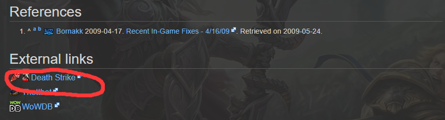
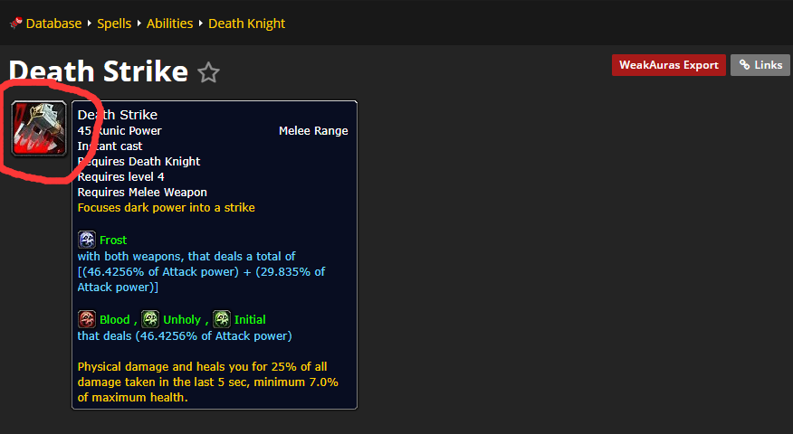
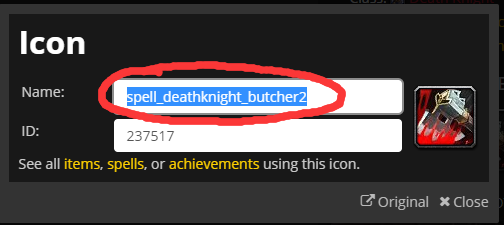

# 反和谐

## 模型反和谐
在**Config.wtf**文件的最后加上如下语句。
```
SET overrideArchive "0"
```
**Config.wtf**文件路径为**World of Warcraft/retail/WTF/Config.wtf**。

## 图标反和谐
WOW支持自定义图标，所以可以通过设置自定义图标图片来手动反和谐。
操作流程如下（以DK的技能**灵界打击**为例）：

1. 下载原版图标。

   从该[链接](https://wowwiki.fandom.com/wiki/Category:Abilities)下载。
   
   若知道技能英文名称，直接在顶部搜索框中搜索技能的英文名称，如灵界打击为**Death Strike**，之后进入相应技能页面。
   
   若不知道技能英文名称，可以先在页面中找到对应职业的链接，之后在职业页面中找到相应技能。此处为**Category:Death knight abilities**页面，然后**Death Strike**页面。
   
   
   
   点击上图红圈处进入如下页面。
   
   
   
   点击上图红圈处进入如下页面。
   
   

   选择**图片另存为**，保存该图片。

2. 将图片文件重命名为技能名称。

   
   
   回到技能图标页面，滚动到**External links**区域。点击红圈位置打开技能详细信息页面。
   
   
   
   红圈处文字即为技能名称。
   
   

3. 将图标格式转换为blp。

   用图片格式转换工具**BLPNG Converter**进行转换。
   
   
   
   将下载好的技能图标图片拖到红圈处即可。提示转换完成之后会在与技能图标图片相同的路径下生成技能图标的blp文件。


4. 将转换好的blp文件放入**World of Warcraft/_retail_/Interface/Icons**下。(若没有该路径就手动建立路径)